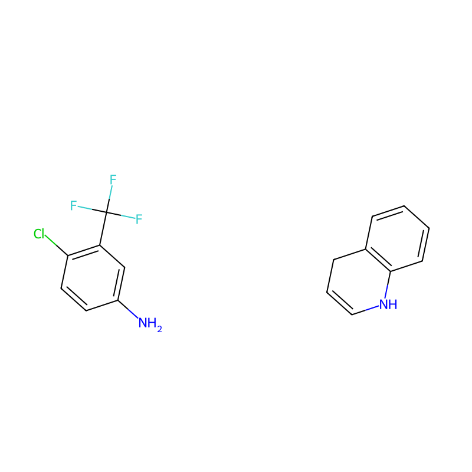
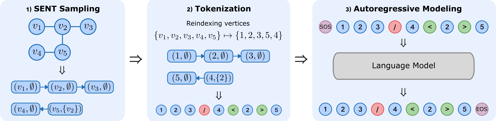

<!-- markdownlint-disable first-line-h1 -->
<div align="center">
  
</div>

# AutoGraph: Transformers are Scalable Graph Generators

This repository implements AutoGraph presented in the following paper:

>Dexiong Chen, Markus Krimmel, and Karsten Borgwardt.
[Flatten Graphs as Sequences: Transformers are Scalable Graph Generators][1], Preprint 2025.

**TL;DR**: A scalable autoregressive model for attributed graph generation using decoder-only transformers

<div align="center">
<table style="width: 80%">
  <tr>
    <td align="center"><b>Unconditional generation</b></td>
    <td align="center"><b>Conditional generation</b></td>
  </tr>
  <tr>
    <td></td>
    <td></td>
  </tr>
</table>
</div>

## Overview

By flattening graphs into random sequences of tokens through a reversible process, AutoGraph enables modeling graphs as sequences __in a manner akin to natural language__. This results in sampling complexity and sequence lengths that scale optimally linearly with the number of edges, making it scalable and efficient for large, sparse graphs. A key success factor of AutoGraph is that its sequence prefixes represent induced subgraphs, creating a direct link to sub-sentences in language modeling. Empirically, AutoGraph achieves state-of-the-art performance on synthetic and molecular benchmarks, with up to 100x faster generation and 3x faster training than leading diffusion models. It also supports substructure-conditioned generation without fine-tuning and shows promising transferability, bridging language modeling and graph generation to lay the groundwork for graph foundation models.

The flattening process relies on sampling a sequence of random trail segments with neighborhood information (i.e. a SENT), by traversing the graph through a strategy similar to depth-first search. More details can be found in Algorithm 1 in our [paper][1]. The obtained sequence is then tokenized into a sequence of tokens which can be modeled effectively with a transformer.

<p align="center">
  
</p>

## Installation

We recommend the users to manage dependencies using [miniconda](https://docs.conda.io/projects/miniconda/en/latest) or [micromamba](https://mamba.readthedocs.io/en/latest/installation/micromamba-installation.html):

```bash
# Replace micromamba with conda if you use conda or miniconda
micromamba env create -f environment.yaml 
micromamba activate autograph
cd autograph/evaluation/orca; g++ -O2 -std=c++11 -o orca orca.cpp; cd ../../..
pip install -e .
```

## Model Downloads

You can download all the pretrained models [here](https://datashare.biochem.mpg.de/s/51FI1NTx2k75pfH) and unzip it to `./pretrained_models`.

## Model Running

The configurations for all experiments are managed by [hydra](https://hydra.cc/), stored in `./config`.

Below you can find the list of experiments conducted in the paper:

- Small synthetic datasets: Planar and SBM introduced by [SPECTRE](https://arxiv.org/abs/2204.01613).
- Large graph datasets: Proteins and Point Clouds introduced by [GRAN](https://arxiv.org/abs/1910.00760).
- Molecular graph datasets: [QM9](https://arxiv.org/abs/1703.00564), [MOSES](https://github.com/molecularsets/moses), and [GuacaMol](https://github.com/BenevolentAI/guacamol).
- Our pre-training dataset (unattributed graphs): NetworkX, which is based on graph generators from [NetworkX](https://networkx.org/documentation/stable/reference/generators.html).

### Pre-trained Model Evaluation

```bash
# You can replace planar with any of the above datasets
dataset=planar # can be sbm, protein, point_cloud, qm9, moses, guacamol, networkx
pretrained_path=${path_to_the_downloaded_model}
python test.py model.pretrained_path=${pretrained_path} experiment=test_${dataset}
```

### Supervised Training

```bash
# You can replace planar with any of the above datasets
python train.py experiment=planar # can be sbm, protein, point_cloud, qm9, moses, guacamol, networkx
```


[1]: https://arxiv.org/abs/2502.02216